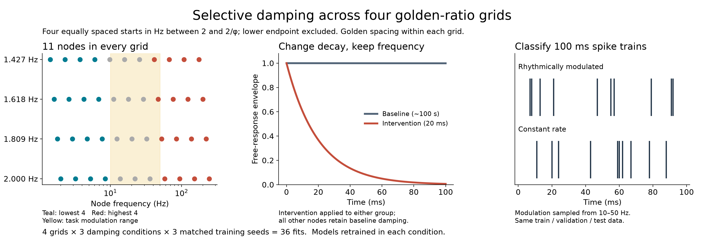
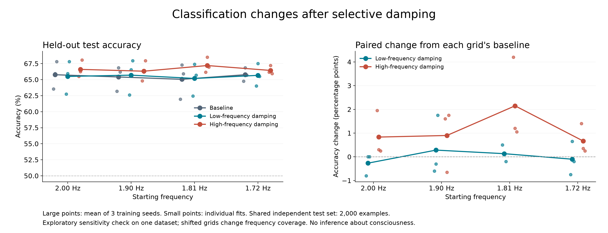

# Exploring selective damping in resonant recurrent networks

This computational neuroscience class project extends
[Mark A. Kramer's resonant recurrent network repository](https://github.com/Mark-Kramer/Resonant-Recurrent-Network)
and the paper [Brain-inspired, interpretable, resonant recurrent neural networks](https://arxiv.org/abs/2506.17083).
We investigate how making selected oscillators decay faster affects
classification, and whether that effect depends on their exact frequencies.

We completed **36 training runs**. High-frequency damping improved average
accuracy in each of the four tested frequency grids; low-frequency damping had
little average effect. These are exploratory results on one synthetic dataset.

## Motivation and research question

The RRN's brain-inspired structure prompted a question in our team: if activity
at some frequencies becomes less persistent, does the network become less
effective at processing information?

Our initial motivation came from observations of different frequency patterns
in brain states with different levels of consciousness. But measured brain
activity does not uniquely specify oscillator damping, and classifier accuracy
does not measure consciousness. We therefore ask a narrower, testable question:

> How does selectively shortening the persistence of low- versus high-frequency
> nodes affect classification, and does the effect persist across nearby
> golden-ratio frequency grids?

This is a small extension, rather than a reproduction of all the paper's
experiments. It demonstrates recurrence, resonance, damping, temporal features,
and controlled model comparisons.

## Model background

Each RRN node is a damped oscillator whose current state depends on its states
at the previous two time steps. All nodes receive the same input, and trainable
connections allow input-dependent nonlinear interactions between nodes.

| Property | Meaning |
|---|---|
| Frequency `f` | How quickly the node oscillates and which rhythms it preferentially responds to |
| Damping factor `r` | How slowly its free response fades; smaller `r` means faster decay |

Reducing `r` does **not** make a node oscillate at a lower frequency. It changes
persistence, resonance width, and gain. The free-response decay time is
`tau = -1 / (Fs * ln(r))`, where `Fs` is the sampling rate.

The classifier summarizes each node using time-averaged squared oscillator
amplitude, computed from both position and estimated velocity. Batch
normalization and a linear layer produce class predictions. Training learns
connections and classifier parameters; frequencies and damping remain fixed
within each condition.

## Synthetic spike-train task

Inputs are sequences of zeros and ones: a one means at least one spike occurred
in a one-millisecond bin. Each sequence lasts 100 ms and contains 100 samples.
The model predicts which process generated it:

| Class | Underlying spike rate |
|---|---|
| Constant | Constant rate of 100 spikes per second |
| Modulated | Sinusoidally varying rate, with modulation frequency sampled between 10 and 50 Hz |

Spiking is random in both classes. The classes share a nominal mean-rate
parameter, but finite-window spike counts can differ. The task can therefore
contain count cues as well as temporal-pattern cues.

## Experiment design

We use four starting frequencies: approximately **2.00, 1.90, 1.81, and
1.72 Hz**. Each grid contains exactly 11 nodes, with adjacent frequencies
separated by a factor of 1.618. Shifting the starting point changes the whole
grid while preserving its spacing and model size.

For each grid, we train three conditions from scratch:

| Condition | Intervention |
|---|---|
| Baseline | Original damping at every node: `r = 0.99999` |
| Low-frequency damping | Faster decay at the lowest four nodes |
| High-frequency damping | Faster decay at the highest four nodes |

Faster decay uses a **20 ms decay time**: `r = exp(-1 / (1000 * 0.020))`,
approximately 0.95123. Baseline decay time is approximately 100 seconds.
The intervention is an illustrative modeling choice, not a clinical estimate.

"Low" and "high" refer to node ranks, not clinical EEG bands. The highest four
original nodes are approximately 58, 94, 152, and 246 Hz, mostly above the task's
modulation range. Shifts change overall coverage and introduce nodes below the
paper's 2 Hz lower bound. This is a check of nearby placements, not a comparison
of different frequency ratios.

Each configuration uses three training seeds: **4 grids × 3 conditions ×
3 seeds = 36 fits**. For each seed, initialization and minibatch order are
matched across configurations. All models share identical, independently
generated training, validation, and test splits:

| Split | Examples | Purpose |
|---|---:|---|
| Training | 1,000 | Learn weights |
| Validation | 200 | Select the best training checkpoint |
| Test | 2,000 | Evaluate the selected checkpoint |

Each split is balanced between classes. The larger test set is a departure
from the paper's 200 examples to reduce test-score noise. Training runs for
30 epochs with AdamW, gradient clipping, and OneCycle scheduling. Test scores
do not select checkpoints or settings.

We measure **paired accuracy changes** against the baseline with the same grid
and training seed.



## Recorded results

Means across three training seeds; changes are in percentage points relative
to each grid's baseline:

| Starting frequency | Baseline accuracy | Low-frequency damping change | High-frequency damping change |
|---|---:|---:|---:|
| 2.00 Hz | 65.77% | -0.27 | +0.83 |
| 1.90 Hz | 65.42% | +0.28 | +0.90 |
| 1.81 Hz | 65.05% | +0.13 | +2.15 |
| 1.72 Hz | 65.77% | -0.10 | +0.67 |

High-frequency damping improved the mean in all four grids and improved 11 of
12 individual paired fits. Low-frequency damping had small, mixed effects.
The figure shows individual fits as well as means.



A possible explanation is that damping nodes mostly outside the modulation
range reduces unhelpful responses or changes their interactions with other
nodes. We have not isolated this mechanism: damping changes gain, filtering,
and feature scaling, and retraining changes learned connections.

The supported conclusion is a **task-dependent damping effect whose positive
high-frequency mean persists across these four placements**. It does not
establish a consciousness mechanism or universal superiority of golden spacing.

## Run the experiment

From the repository root in Windows PowerShell, using Python 3.13:

```powershell
python -m venv .venv
.\.venv\Scripts\python.exe -m pip install -r experiments/damping/requirements-lock.txt
.\.venv\Scripts\python.exe -m unittest experiments.damping.test_experiment -v
.\.venv\Scripts\python.exe experiments/damping/run.py --output experiments/damping/results_rerun
.\.venv\Scripts\python.exe experiments/damping/plot_results.py --results experiments/damping/results_rerun
.\.venv\Scripts\python.exe experiments/damping/verify_results.py --results experiments/damping/results_rerun --replay
```

These commands save a new run without overwriting the recorded study. On
Linux/macOS, replace `.\.venv\Scripts\python.exe` with `.venv/bin/python`.
The locked requirements record our environment; exact matching across hardware
and library versions is not guaranteed.

The runner saves metrics, histories, checkpoints, predictions, and provenance.
Figures are exported as PNG, SVG, and PDF. The method and result figures form
the planned two-slide presentation extension.

## Code and documentation

| File | Purpose |
|---|---|
| [RRN_functions.py](RRN_functions.py) | Model with optional explicit frequencies and per-node damping |
| [config.json](experiments/damping/config.json) | Complete experiment settings |
| [run.py](experiments/damping/run.py) | Data generation, paired training, and measurements |
| [test_experiment.py](experiments/damping/test_experiment.py) | Scientific invariant tests |
| [plot_results.py](experiments/damping/plot_results.py) | Figures from recorded results |
| [verify_results.py](experiments/damping/verify_results.py) | Measurement audit and optional complete baseline replay |
| [Recorded results](experiments/damping/results/RESULTS.md) | Summary, with raw CSV files and histories alongside it |
| [Interpretation](experiments/damping/results/INTERPRETATION.md) | Findings, possible explanations, and slide narration |
| [Detailed methods](experiments/damping/README.md) | Full design, implementation details, and execution instructions |
| [Code review guide](experiments/damping/CODE_REVIEW.md) | Upstream base, review scope, and portable repository instructions |

Six scientific tests passed, all recorded results were audited, and a complete
30-epoch baseline replay reproduced its recorded metrics exactly. Large
datasets, checkpoints, and predictions are excluded from Git and can be
regenerated. Small result tables, histories, provenance, and figures are included.

## Limitations and future work

This exploratory study uses one dataset, three training seeds, four deterministic
grids, and one damping strength. It does not establish statistical significance
or broad generalization. Grid shifts change coverage as well as alignment.
Stability checks apply to isolated oscillator modes, not a proof of
coupled-network stability.

Useful next experiments include independent datasets, other decay times,
different modulation ranges, and comparisons of frequency spacings with
matched node counts.

## Original notebooks and attribution

The upstream notebooks are retained for reference:

| Notebook | Original analysis |
|---|---|
| [RRN_Results.ipynb](RRN_Results.ipynb) | RRN MNIST experiments and figures |
| [LSTM_Results.ipynb](LSTM_Results.ipynb) | LSTM MNIST experiments |
| [Standard_RNN_Results.ipynb](Standard_RNN_Results.ipynb) | Standard RNN MNIST experiments |
| [RRN_Simulated.ipynb](RRN_Simulated.ipynb) | Synthetic spike-train experiments |

These notebooks may need additional dependencies and data; our extension's
runner does not depend on them. The model architecture and original experiments
are Kramer's work. The selective-damping study, shifted-grid comparisons,
runner, tests, and figures are the class-project extension.
